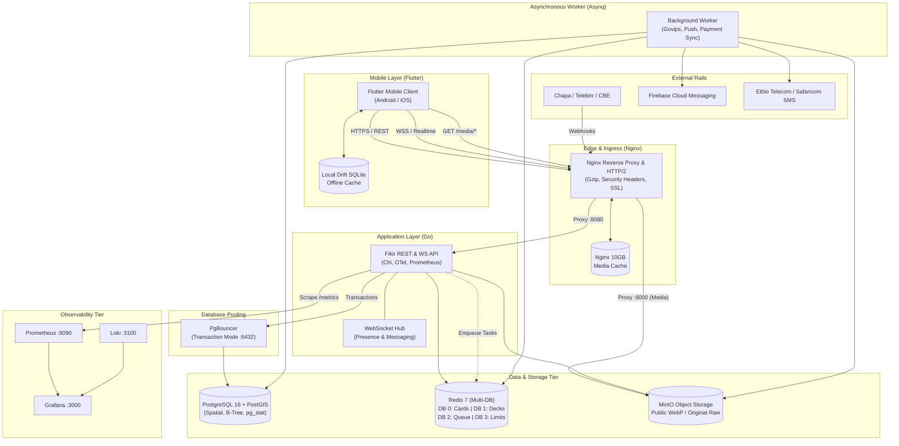
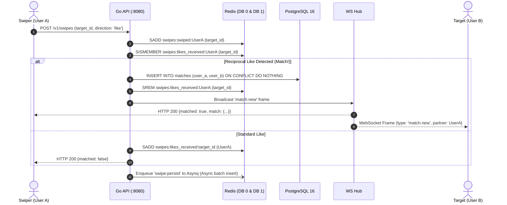
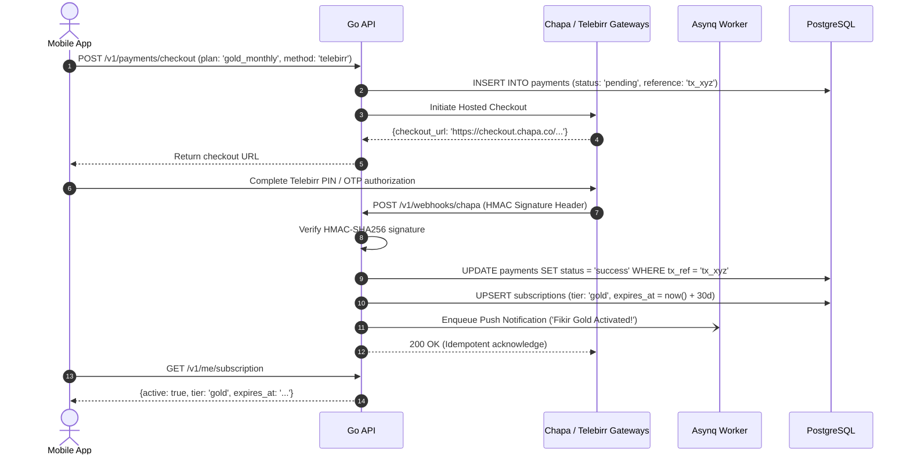

# Fikir System Architecture & Infrastructure

This document describes the end-to-end technical architecture of **Fikir**, an Ethiopian dating platform engineered for high performance, low-bandwidth resilience, and rock-solid trust & safety.

---

## 1. High-Level System Architecture

---

## 2. Core Workflows

### A. Swiping & Instant Mutual Match Sequence

### B. Ethiopian Payment & Subscription Activation Flow

---

## 3. Ethiopian Infrastructure & Mobile Constraints Optimization

1. **Not-Modified Caching & ETags**:
   `GET /v1/me/profile` and candidate discovery decks support HTTP `ETag` and `If-None-Match`, returning lightweight `304 Not Modified` to conserve expensive 3G mobile data.
2. **Anti-Triangulation Guarantees**:
   Raw GPS coordinates are never sent to clients. Distances are computed via PostGIS `ST_Distance` on geography points, rounded to integer kilometers, and obscured with 200m–800m randomized jitter.
3. **Low-End Android Optimization**:
   * Pre-fetches only 10–15 cards into memory.
   * Compresses images on-device before uploading (`flutter_image_compress`).
   * Renders with hardware acceleration using BlurHash placeholders.
4. **Resilient Offline Architecture**:
   Drift SQLite stores matches and unread conversations locally. App cold starts instantaneously in offline mode and reconciles automatically upon reconnecting.

---

## 4. Multi-Node Scale-Out Roadmap

When scaling beyond a single VPS (e.g. > 250,000 DAU):
* **Database**: Migrate from containerized Postgres to AWS RDS for PostgreSQL with Read Replicas and automated PITR (Point-in-Time Recovery).
* **Media Storage & CDN**: Switch MinIO to Amazon S3 (or Cloudflare R2) fronted by Cloudflare CDN for edge caching in East Africa (Nairobi PoP).
* **API Scaling**: Run multiple stateless Go API replicas behind an AWS Application Load Balancer (ALB) or Hetzner Load Balancer.
